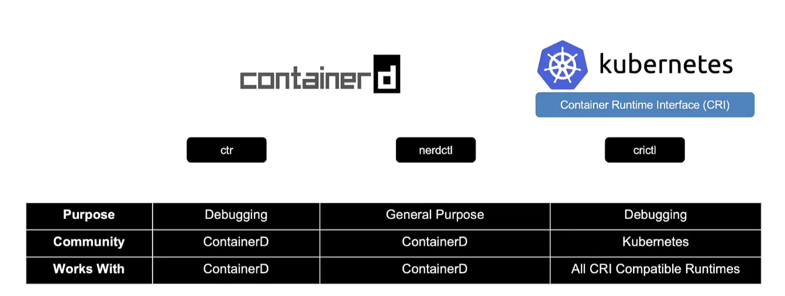

"# Docker vs Containerd

Kubernetes requires a container runtime (CRI) as part of the **Open Container Initiative (OCI)** standards.

## Most Popular Container Runtimes
1. **Docker**  
2. **rkt.io**  
3. **Containerd**  

## Kubernetes and Docker Support
- Kubernetes originally supported Docker via **dockershim**.  
- Starting from **Kubernetes 1.24**, Docker support has been **removed**.  
- **Containerd** is now fully compatible with CRI and recommended for Kubernetes.

## Containerd CLI Tools
- **`ctr`**: A CLI tool that comes with containerd.  
  - It supports limited features compared to Docker.  
  - Example usage:  
    ```bash
    ctr images pull <image-name>
    ```

- **`nerdctl`**: A tool similar to Docker CLI.  
  - Supports **Docker Compose** and provides a **Docker-like CLI**.  
  - Most Docker commands work seamlessly with `nerdctl`.

- **`crictl`**:  
  - Used to **inspect** and **debug** container runtimes.  
  - Especially useful for Kubernetes environments relying on CRI-compatible runtimes.
"""
